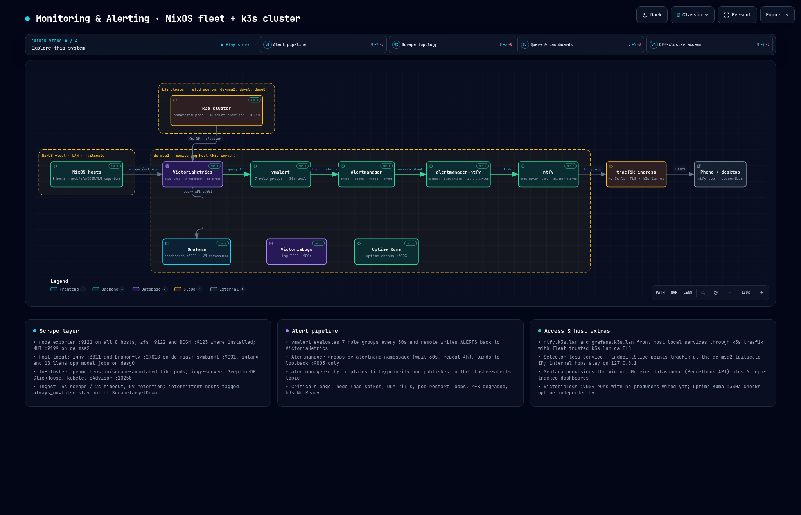
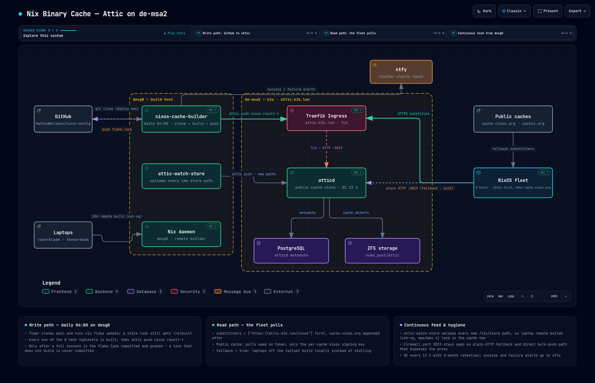

# nixos-config

A declarative, reproducible home-and-lab NixOS fleet — nine machines, one
k3s cluster, full-disk secrets, GitOps-deployed workloads, and a unified
HTTPS service mesh over tailscale — all from a single flake.

> `sudo nixos-rebuild switch --flake .#<host>` rebuilds any machine.
> `nix run .#nixidy -- switch .#prod` reconciles the entire cluster.

---

## Highlights

### 🖥️ Fleet of nine NixOS hosts, one flake

Every host — from the k3s server `de-msa2`, to the GPU box `desg0`, to the
laptops `razerblade` / `tensorbook` — is defined in `hosts/<name>/` and built
from the same flake. Add a machine: drop a directory, add one line to
`flake.nix`, rebuild.

| Host | Role |
|------|------|
| `de-msa2` | k3s server + monitoring/alerting + git forge + self-hosted apps |
| `desg0` | GPU node (remote builder, LLM serving) |
| `meshify` / `superserver` / `poweredge` / `de-n5` | servers & nodes |
| `razerblade` / `tensorbook` | laptops (Hyprland desktop) |

### ☸️ k3s cluster with GitOps via nixidy + ArgoCD

A self-hosted k3s cluster whose workloads are rendered by
[**nixidy**](https://github.com/arnarg/nixidy) from Nix (`env/*.nix`) into YAML
manifests (`manifests/prod/`), then continuously reconciled by **ArgoCD** with
auto-sync, prune and self-heal. The cluster manages **itself**: ArgoCD and
cert-manager are declared as nixidy apps and bootstrapped through GitOps.

- `env/argocd.nix` — ArgoCD, exposed at `https://argocd.k3s.lan`
- `env/cert_manager.nix` — a self-signed root CA (`k3s-lan-ca`) generated
  in-cluster, its public cert trusted fleet-wide, so every `*.k3s.lan` service
  has a browser-trusted TLS cert with zero manual trust steps
- `env/host_ingress.nix` — fronts host-local NixOS services (ntfy, forgejo,
  grafana, vikunja) at `*.k3s.lan` via traefik + cert-manager
- `env/homepage.nix` — [homepage](https://gethomepage.dev) dashboard at
  `https://home.k3s.lan`, auto-discovering every annotated `*.k3s.lan` Ingress

### 🔔 Full observability & alerting stack

`hosts/de-msa2/alerting.nix` + `prometheus.nix` declare the entire monitoring
pipeline, rules included, reproducibly:

```
victoriametrics → vmalert (rule eval) → alertmanager
  → alertmanager-ntfy bridge → ntfy-sh (push to phone)
```

Node, ZFS, NVIDIA-GPU and Kubernetes (kube-state-metrics) metrics are all
scraped. Alert rules are set to notify if things go haywire, so the stack fires
on `NodeLoadHigh`, `ContainerCPUNearLimit`, `PodRestartLooping`, `OOMKilled`
and more — paging the ntfy app at `https://ntfy.k3s.lan/cluster-alerts`.

In the ntfy web interface at `https://ntfy.k3s.lan`, manually subscribe to the
**`cluster-alerts`** topic. This is the only required subscription; it receives
production, development (prefixed `[dev]`), host, storage, and cluster alerts.
ntfy topics are created on first publish, so they are not listed automatically
in a new browser profile.



An explorable version with guided views is in
[`docs/diagrams/monitoring-alerting.html`](docs/diagrams/monitoring-alerting.html).

### 🔐 Secrets managed with agenix

Host-specific secrets (k3s token, grafana secret key, …) live encrypted in
`secrets/` and are decrypted at activation via
[agenix](https://github.com/ryantm/agenix). Plaintext never touches the repo.

### 🌐 Tailscale mesh + Mullvad split tunnel

`modules/mullvad_tailscale.nix` wires a Mullvad WireGuard exit node alongside
tailscale, with a deterministic DNS fallback via `/etc/hosts` so routing works
regardless of who owns `resolv.conf`. Every `*.k3s.lan` name resolves to a
node's tailscale IP through `networking.hosts` in `modules/base_system.nix`.

### 🤖 Local AI stack

`modules/ai/` declares a battery of local LLM serving options: `vllm_cuda_container`, `tensorrt_llm_container`, `llama-cpp`, a
`hermes-agent` runner, `qwen_code`, and a `pi-agent` harness. The
`remote_builder.nix` module turns GPU hosts into distributed nix builders over
SSH.

### 🧪 Sandboxed agent tasks (ax + Agent Substrate)

The cluster runs [google/ax](https://github.com/google/ax) as the task API on
top of [Agent Substrate](https://github.com/agent-substrate/substrate), which
runs each task in a gVisor sandbox. A task can be suspended into a snapshot
and resumed later. Both projects are pre-alpha: every image is built with Nix
and pinned by digest. Build notes and open items are in
[`docs/ax_stack_todo.md`](docs/ax_stack_todo.md).

How it fits together:

- **Substrate** (`env/substrate.nix`, `hosts/de-msa2/substrate.nix`): API
  server, controller, `atelet` and the gVisor worker pool. Workers run only on
  the Zen-4 nodes (`desg0`, `de-n5`), because golden snapshots must not move
  between CPU generations. Snapshots go to rustfs (S3).
- **ax** (`env/ax.nix`, `pkgs/ax/`): `ax-server` (gRPC API), `ax-controller`
  and Redis in `ax-system`. The API is at `ax.k3s.lan:80` (plaintext h2c
  through traefik). It is also on the homepage under *AI*.
- **Default task image**: tasks without `spec.image` run the Nix-built
  `ax-task-runner`. It ships `git`, `curl`, the fleet CA and the
  [`pi`](https://pi.dev) coding agent, which is preconfigured for Qwen3.8 on
  desg0's SGLang (`OPENAI_BASE_URL=http://192.168.0.13:8000/v1`).
- **ax objects** (`manifests/ax/`): Gateways, Workspaces and Tasks live in
  ax's Redis, not in Kubernetes. ArgoCD does not apply them. Use `ax_apply`.

#### Client-side usage

Every Home Manager host has the `ax` and `kubectl-ate` CLIs (`home/home.nix`).
There are two ways to reach the server:

| Where | How ax connects | What works |
| --- | --- | --- |
| tensorbook (no fleet kubeconfig) | `AX_SERVER=ax.k3s.lan:80`, set in nushell | `apply`, `get`, `describe`, `watch`, `suspend`, `resume`, `delete` |
| de-msa2, meshify (as `m`) | port-forward through the fleet kubeconfig (`home/k3s_kubeconfig.nix`) | everything, including `ax ssh` and `kubectl ate` |

`ax ssh` and `kubectl ate` always need a kubeconfig, because they tunnel to
`atenet-router`. Do not run `ax` with `sudo`: sudo keeps `HOME` and leaves
root-owned `~/.kube` and `~/.ax` behind. In a shell other than nushell on
tensorbook, export `AX_SERVER=ax.k3s.lan:80` first.

Apply the shared objects (Gateways, Models, Workspaces), then a Task:

```sh
nix run .#ax_apply                                    # everything shared in manifests/ax/
nix run .#ax_apply -- manifests/ax/task-smoke-pi.yaml # one Task
```

A minimal Task that lets pi work on a cloned repo:

```yaml
apiVersion: ax.io/v1alpha1
kind: Task
metadata:
  name: smoke-pi
  atespace: default
spec:
  command: [bash, -c, 'pi -p --no-session "Summarize this repo into /workspace/summary.md"']
  workspaces:
    - name: monty-persona # cloned into /workspace, the working directory
  gateway:
    name: lan-llm         # egress to desg0 (SGLang) and Forgejo
  debug: true             # needed for `ax ssh`
```

Watch and inspect it:

```sh
ax get tasks
ax watch task smoke-pi        # "Running" is reported as final; check the result with ax ssh
ax ssh smoke-pi -- cat /workspace/summary.md
ax suspend task smoke-pi      # snapshot; `ax resume task smoke-pi` continues
ax delete task smoke-pi       # also removes the Substrate actor
```

Gotchas:

- Delete a Task before you re-apply it under the same name. Otherwise
  Substrate resumes the old actor, with its old image and snapshot.
- The Gateway egress allowlist is recorded but not enforced yet (no egress
  gateway is deployed), so sandbox egress is allow-all.
- Pods can't resolve `*.k3s.lan` names except `forgejo.k3s.lan`. Use LAN IPs
  for other services.
- To ship a new runner image, run `nix run .#ax-push-images` (after
  `skopeo login --tls-verify=false de-msa2:2999`) **before** you push the
  re-rendered manifests. Otherwise the controller points at a digest that is
  not in the registry yet.

### 📦 Fleet Nix binary cache (attic)

The fleet's store paths live in [attic](https://github.com/zhaofengli/attic)
on `de-msa2` (`hosts/de-msa2/attic.nix`), exposed at `https://attic.k3s.lan`
through the cluster ingress. Every host lists it as its first substituter
(`modules/base_system.nix`), with `cache.nixos.org` appended after; the
`nixos` cache is public, so pulls need no token — only the per-cache
signing key.

`desg0` keeps it stocked: the `nixos-cache-builder` timer
(`modules/nixos_cache_builder.nix`) runs daily at 04:00 — clone the repo,
`nix flake update`, build every host's `system.build.toplevel`, `attic push`
the results, and only then commit and push the new `flake.lock`. A lock that
does not build is never committed. Alongside it, `attic-watch-store` uploads
every new path that lands in `desg0`'s store, so remote builds from the
laptops (via `modules/remote_builder.nix`) end up in the cache too.
Retention is enforced by GC: every 12 hours, paths not pulled for 3 months go.



An explorable version with guided views is in
[`docs/diagrams/nix-cache-attic.html`](docs/diagrams/nix-cache-attic.html).

### 🏠 Self-hosted services

A curated set of self-hosted apps, each a NixOS module, fronted over HTTPS
through the cluster ingress where it matters:

**ntfy** (push notifications) · **forgejo** (git + actions + LFS) · **grafana**
(dashboards) · **vikunja** (tasks) · **attic** (nix binary cache) ·
**polaris** (music) · **calibre-web** (ebooks) ·
**mealie** (recipes) · **immich** (photos) · **searx** (search) · **readeck** ·
**uptime-kuma** · and more.

### 🖱️ Hyprland desktops with Home Manager

Laptops run Hyprland managed by Home Manager (`home/home_hyprland.nix`): a
curated terminal set, `helix` editor, `yazi` file manager, `waybar`,
animated wallpapers via `awww`, keyboard-driven mouse control via `stochos`,
and per-host home configs (`home/<host>.nix`).

### 🔑 Hardware & trust

`yubi_key.nix` for GPG/SSH, `k3s_nvidia.nix` for container GPU passthrough,
`virtualization_host.nix` for libvirt VMs (`vms/tor.nix`, `vms/waterfox.nix`),
`backup.nix` / `backup_home_to_remote.nix` for off-host backups.

---

## Layout

```
hosts/        one dir per machine — its configuration.nix + host-local services
modules/      reusable NixOS modules (base system, k3s, AI, networking, desktop)
home/         Home Manager configs (shell, editors, Hyprland, per-host tweaks)
env/          nixidy cluster environment: argocd, cert-manager, host_ingress, homepage, substrate, ax
manifests/    rendered k8s YAML (auto-generated, committed for ArgoCD)
secrets/      agenix-encrypted secrets
scripts/      small nix scripts (wake-on-lan, forgejo starred sync, app list)
vms/          libvirt VM definitions
flake.nix     the single entry point for every host and the nixidy env
```

## Applying a Configuration

Rebuild any host:

```sh
sudo nixos-rebuild switch --flake .#meshify
```

Or with [nh](https://github.com/nix-community/nh) for a friendlier flow:

```sh
nh os switch .
```

Reconcile the whole k3s cluster (renders + pushes manifests; ArgoCD syncs):

```sh
nix run .#nixidy -- switch .#prod
```

## Updating

Pull the newest nixpkgs and rebuild:

```sh
nix flake update
sudo nixos-rebuild switch --flake .#<host> --upgrade-all
```

Update a single input:

```sh
nix flake lock --update-input nixpkgs-unstable
```

Inspect flake metadata:

```sh
nix flake metadata .
```

## Cleaning the Store

```sh
nix-store --gc                      # manual GC
nh clean all --keep 5               # keep the last 5 boot generations
```

## Tips & Tricks

**Cached evaluation errors** — if you hit `error: cached failure of attribute
'nixosConfigurations.<host>…'`, bypass the eval cache:

```sh
--option eval-cache false
```

**Why does X depend on Y?** (e.g. an insecure package pulled in transitively):

```sh
nix why-depends /run/current-system \
  $(nix-build '<nixpkgs>' -A electron_35 --no-out-link)
```

**Exposing a new host-local service at `*.k3s.lan`** — add one entry to the
`services` list in `env/host_ingress.nix`, add the hostname to
`modules/base_system.nix`, set the service's base URL. Done.

## License

MIT.
